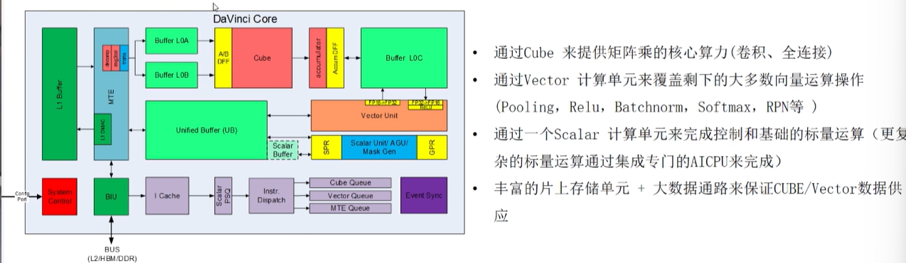
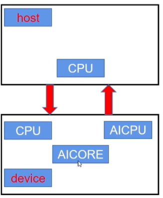
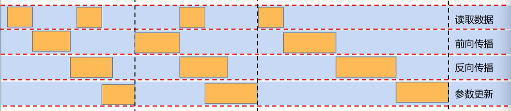
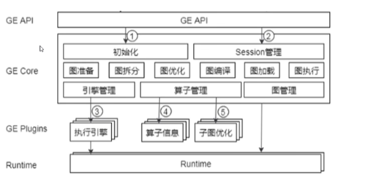
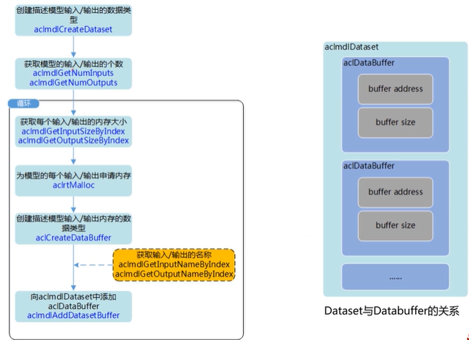
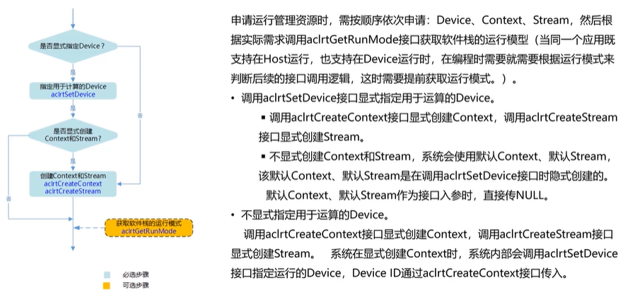
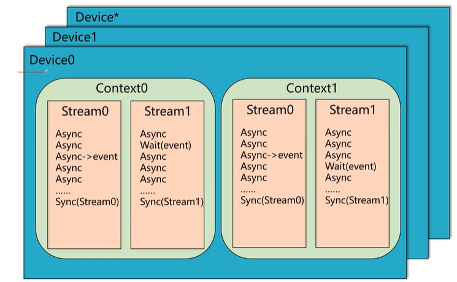

### 昇腾架构基础知识

---

1. 昇腾芯片架构  `AI Core展开图`

   

   简单举例：

   输入分别放在Buffer L0A和Buffer L0B，输出到Buffer L0C中

   

2. 910——训练+推理，310——推理（端侧推理）

   

3. TBE工具，可自定义算子——编写在昇腾上运行的算子，提供Python接口完成算子编写

   最终由TBE工具将Python文件编译为可以在昇腾上直接执行的格式，通过GE Plugins加载到算子信息库中

   

4. GE，负责和昇腾芯片交互，跑在GPU和CPU上走不到GE

   

5. 开发时内存流：

   其中的queue作用是通信和同步

   Global Memory(Global Tensor) 

   --DataCopy--> Local Memory (Local Tensor)

   --Enque--> VECIN Queue

   --Deque--> Local Tensor

   --Compute--> Local Tensor

   --Enque--> VECOUT Queue

   --Deque--> Local Tensor

   --DataCopy--> Global Tensor

   

6. 大模型-->OM文件

   

7. CANN非昇腾设备安装

   [非昇腾设备-安装方案-软件安装 (命令行)-...-文档首页-昇腾社区 (hiascend.com)](https://www.hiascend.com/document/detail/zh/CANNCommunityEdition/700alpha001/softwareinstall/instg/instg_000004.html)

### Graph Engine

---

1. 整图下沉 `On-Device Execution`

   将整张计算图下放到芯片上执行，减少芯片和Host之间的数据交互次数

   **循环下沉**

   在`On-Device Execution`的基础上优化，目的是进一步减少Host侧和Device侧之间的交互次数。通常情况下，每个Step都返回一个结果，循环下沉是控制每隔多少个Step返回一次结果。

   默认配置下，每一个Epoch返回一次结果，在每个Epoch里，Host侧和Device侧只需要进行一次数据交互。[Epoch包括多个Step]
   

   

   * **Host侧CPU**

     整图下发

   * **Device侧CPU**

     深度学习场景下逻辑控制和任务分发任务 [原先的调度和分配工作由Host CPU完成]

   * **AI Core [共32个]**

     大型的Tensor & Vector运算

   * **AI CPU**

     负责较为复杂的标量运算

     [开销和安全性]`避免不适合Tensor Engine执行的标量运算任务部分发回Host侧CPU运算，之后再将结果传回`

   * **片上内存**

     32G：5G(parameter) + 26G(feature map) + 1G(HCCL算子，如all-reduce和broadcast等)

     ``` 
     feature map：
     图像像素值经过过滤器后得到的东西，也就是说在卷积层上看到的：图像经过卷积核后的内容，这一操作也就是所谓的卷积操作`
     ```

     以上是默认分配，可通过修改机器代码修改分配

     

2. 并行计算 `Pipleline Parallel`

   具体的一些并行计算任务，包括：分布式读取数据、并行反向计算

   

   `图中前2个step使用并行，第3个step使用串行`

   * 梯度聚合等参数更新操作，无需等反向传播全部完成。

     如：共100个参数 —— 100个梯度，完成50个梯度计算后就可以开始参数更新工作 [并行完成]

   * 反向传播时Host侧CPU空闲，开始下一个step数据读取 [分布式数据读取]，后一个step直接前向传播

     

3. 昇腾芯片优化 `low level optimization `

   **GE图基本元素：**

   Graph、Node、Anchor、Attributes [从大到小，没有边的概念]

   **GE图格式：**

   * Protext：文本格式，便于搜索、查看、对比算子
   * Onnx：可使用Netron等软件打开，可视化，便于详细分析较小的子图

   **GE图包括的信息：**

   * 图的结构、节点连接关系

   * 算子属性：名称、类型、输入、输出、shape、format

   * 资源分配情况：event、stream、memory offset

     

4. GE架构图

   

   * **图准备**

     [以前端下发的数据流图作为输入]

     * shape推导：

       `以算子之间定义关系，完成定义每个parameter或feature map的大小，便于后续内存分配`

     * 引擎划分[借助代价函数完成]：

       `划分算子适合运行的位置，包括：Device CPU / AI Core / AI CPU、具体分配到哪一个AI Core`

   * **图拆分**

     * 整图拆分：

       `根据算子所属引擎不同，将整图拆为子图，针对不同引擎调用不同优化函数，每个子图的所有算子隶属于同一个引擎，以此为整体单位调用相应的优化函数`

     * 边界标识：

       `由于拆分后会丢失算子之间边界上的连接关系，因此需要边界标识`

   * **图优化**

     * 格式转化：

       `未采用4D（如NCHW, NHWC），采用5D格式`

       AI Core中的CUBE实现矩阵乘加：D=A*B+C，一个cycle执行16 * 16 * 16个乘加运算

       因此若数据本身在Buffer[见昇腾芯片架构部分]中并按照16对齐，则从Buffer中取数据会更为高效

       具体是在C轴方向按照16为单位进行切分：

       `N C H W --> N C1 H W C0，C0 * C1 = C，C0 = 16`

     * 算子融合：

       `将一定范式组合的若干个算子融合为一个大算子，减少数据在内存中的搬运次数`

       如将Conv + BN(Batch Normaliztion) + Relu融合为一个大算子，这个过程BN和Relu本身是两次vector运算，融合后变为一次vector运算

       【优化在Host侧，执行在Device侧？】

   * **图编译**

     * 资源分配：

       `内存等`

     * task编译：

       `每个算子被编译成1个或多个task`

     * stream分配 [并行策略]：

       `每个task被绑定在一个stream上，同一个stream上task顺序执行，不同stream之间可以并行执行。不同stream之间的同步信号使用event标识`

   * **图加载**

     `加载至硬件上`

   * **图执行**

     `调用runtime，返回结果`


### GE Debug

---

1. dump：
   * 数据dump（整个网络中所有算子的输入输出）
   * 图dump，图dump包括protext格式和Onnx格式
2. profiling[仅限昇腾]：为每个算子打点，精确得到每个算子的运行情况，可以对性能进行完善的分析
3. Stream可视化：stream_analyzer.py脚本


### 文档学习

---

1. 修改图（在const算子和add算子之间添加abs算子）

   ``` c++
   #include "graph.h"
   #include "ascend_string.h"
   #include "ge_ir_build.h"
   #include "gnode.h"
   
   ...
   	/*===================================================================================
   		(Ⅰ) GetAllNodes，遍历，找到const算子和add算子
   	
   		(Ⅱ) RemoveEdge，删除const算子和add算子的连边（数据边或控制边）
   	
   		(Ⅲ) 参考算子原型衍生接口定义算子，创建Operator类算子abs（也可调用OperatorFactory::CreateOperator创建算子）
   	
   		(Ⅳ) AddNodeByOp，创建GNode类算子abs
   	   	    创建算子后，可根据需要更新该算子的input和output TensorDesc，一般根据前一节点（src_node）的Output 
   	   	    TensorDesc更新被添加算子（abs）的Input TensorDesc和Output TensorDesc。否则系统设置默认值，模型编译时
   	   	    对Tensor Shape，type推导
   	  
   		(Ⅴ) AddDataEdge，添加const算子和abs算子，abs算子和add算子之间连边	
   	===================================================================================*/
   	GNode src_node;
   	GNode dst_node;
   	std::vector<GNode> nodes = graph.GetAllNodes();
   	for(auto &node : nodes) {
     		ge::AscendString name;
     		node.GetName(name);
         	std::string node_name(name.GetString());
     		if(node_name == CONST) { src_node = node;}
     		else if(node_name == ADD) { dst_node = node;}
   	}
   	graph.RemoveEdge(src_node, 0, dst_node, 0);
   	auto abs = op::Abs("input3_abs");
   	GNode node_abs = graph.AddNodeByOp(abs);
   	TensorDesc output_tensor_desc;
   	src_node.GetOutputDesc(0, output_tensor_desc);
       abs.UpdateInputDesc(0,  output_tensor_desc);
       abs.UpdateOutputDesc(0, output_tensor_desc);
   	/*=================================================================================== 	
   		此处可使用AddControlEdge添加控制边
   		例：
   		若图中某个算子的执行依赖于图中其他算子执行完，若需控制先执行A算子再执行B算子，则需要调用AddControlInput接口，对		B算子增加控制边。
   		
   		注：此处使用了AddControlEdage
   	===================================================================================*/
       graph.AddDataEdge(src_node, 0, node_abs, 0);
       graph.AddDataEdge(node_abs, 0, dst_node, 0);
   ```

   ``` c++
   	/*=================================================================================== 	
   		修改图之前，可调用aclgrphDumpGraph把Graph dump到本地，查看Graph信息。
   		此步骤为可选，需要注意的是，aclgrphDumpGraph接口必须在SetInputs接口和SetOutputs接口之后调用，例如：
   	===================================================================================*/
       string op_name = "tc_ge_openpass_0001";
       Graph graph(op_name);
       auto data = op::Data("data").set_attr_index(0);
       TensorDesc data_desc2(ge::Shape({3, 3, 3, 3}), FORMAT_NHWC, DT_FLOAT);
       data.update_input_desc_x(data_desc2);
       data.update_output_desc_y(data_desc2);    
       auto matrixinverse = op::MatrixInverse("MatrixInverse").set_input_x(data);
       auto square1 = op::Square("square1").set_input_x(matrixinverse);
       std::vector<Operator> inputs{data};
       std::vector<Operator> outputs{data,square1};
       graph.SetInputs(inputs).SetOutputs(outputs);
       std::map<std::string, std::string> init_options = {
            {ge::ir_option::SOC_VERSION,"xxx"}
       };
       auto ret_init = aclgrphBuildInitialize(init_options);
       EXPECT_EQ(ret_init, GRAPH_SUCCESS);
       std::cout << "BuildInitialize before infershape Success." << endl;
   	size_t filesize =24;
   	const char* file = "tc_ge_openpass_0001_dump";
   	auto ret = ge::aclgrphDumpGraph(graph,file,filesize);
       if(ret != GRAPH_SUCCESS) {
           std::cout<<"dump graph faied."<<std::endl;
       }	
   	ACL_LOG("AclgrphDumpGraph，size[%d]",filesize);
       int result = AclgrphBuildModel(graph,op_name);
   ```

   

2. 编译Graph，序列化保存离线模型到文件——om文件

   * Graph定义完成后，调用`aclgrphBuildInitialize`进行系统初始化，申请系统资源。

     在该步骤中，离线模型编译初始化信息当前支持的配置参数可参考：
     https://www.hiascend.com/document/detail/zh/CANNCommunityEdition/700alpha002/infacldevg/graphdevg/atlasgeapi_07_0112.html

   * 调用`aclgrphBuildModel`将Graph编译为适配昇腾AI处理器的离线模型，编译过程中会加载TBE内置算子库和自定义算子库。此时模型保存在内存缓冲区中。

   * 如果希望将内存缓冲区中的模型保存为离线模型文件xx.om，可以调用`aclgrphSaveModel`，序列化保存离线模型到文件中。

   * 调用`aclgrphBuildFinalize`结束进程，释放系统资源。

     ``` c++
     #include "ge_ir_build.h" 
     #include "ge_api_types.h"
     
     ...
         
         /*=================================================================================== 	
         	aclgrphBuildInitialize，创建Graph后完成系统初始化，申请资源
         	可通过传入global_options参数配置离线模型编译初始化信息
         	SOC_VERSION为必选配置，用于指定目标芯片版本，值${soc_version}根据实际情况替换
     	===================================================================================*/
         std::map<AscendString, AscendString> global_options = {
             {ge::ir_option::SOC_VERSION, "${soc_version}"},
         };
     	auto status = aclgrphBuildInitialize(global_options);
     	
     	...
             
         /*=================================================================================== 
         	aclgrphBuildModel，将Graph编译为离线模型
         	此时模型留存在内存缓冲区中
         =================================================================================== */
         ModelBufferData model;
     	std::map<AscendString, AscendString> options;
     	PrepareOptions(options);
     
     	status = aclgrphBuildModel(graph, options, model);
     	if(status == GRAPH_SUCCESS) {
         	cout << "Build Model SUCCESS!" << endl;
     	}
     	else {
         	cout << "Build Model Failed!" << endl;
     	}
     	
     	...
         
         /*=================================================================================== 
         	[可选]aclgrphSaveModel，将内存缓冲区中的模型保存为离线模型文件
         =================================================================================== */
         status = aclgrphSaveModel("ir_build_sample", model);
     	if(status == GRAPH_SUCCESS) {
             cout << "Save Offline Model SUCCESS!" << endl;
     	}
     	else {
             cout << "Save Offline Model Failed!" << endl;
     	}
     	/*=================================================================================== 
     		aclgrphBuildFinalize，构图进程完成后释放资源
     	=================================================================================== */
     	aclgrphBuildFinalize();
     ```

     在编译为离线模型这一步骤中，可通过传入**options**参数配置离线模型编译配置信息，当前支持的配置参数可参考：

     [aclgrphBuildInitialize支持的配置参数-数据类型-构图接口-...-文档首页-昇腾社区 (hiascend.com)](https://www.hiascend.com/document/detail/zh/CANNCommunityEdition/700alpha003/infacldevg/graphdevg/atlasgeapi_07_0112.html)

     [aclgrphBuildModel支持的配置参数-数据类型-构图接口-...-文档首页-昇腾社区 (hiascend.com)](https://www.hiascend.com/document/detail/zh/CANNCommunityEdition/700alpha003/infacldevg/graphdevg/atlasgeapi_07_0113.html)
     
     ``` c++
     void PrepareOptions(std::map<AscendString, AscendString>& options) {
         options.insert({
             {ge::ir_option::EXEC_DISABLE_REUSED_MEMORY, "1"} // close reuse memory
         });
     }
     ```
     
     

   3. 应用场景
   
      | **work-flows**                                             | **功能说明**                                                 |
      | ---------------------------------------------------------- | ------------------------------------------------------------ |
      | 编译Graph为离线模型                                        | **把Graph编译并保存为om离线模型**，编译生成的离线模型通过AscendCL中`aclmdlLoadFromFile`接口加载，并通过`aclmdlExecute`接口执行推理模型。 |
      | 编译并直接运行Graph                                        | 构建完Graph之后，**直接编译并运行Graph**，使用`AddGraph`接口加载Graph对象，最后使用`RunGraph`运行Graph，**得到图的执行结果**。 |
      | 编译Graph为离线模型并运行Graph（大模型分布式编译切分场景） | **大模型分布式编译切分场景使用。**首先编译出**可用于分布式部署**的om离线模型，然后使用`LoadGraph`接口加载模型，最后使用`RunGraph`运行加载了该模型的Graph，得到图的执行结果。 |

      加载OM文件：

      * `LoadGraph`

        只能用于分布式部署的离线模型

      * `aclmdlLoadFromFile`

        从文件加载离线模型数据（适配昇腾AI处理器的离线模型），由系统内部管理内存
   
        系统完成模型加载后，返回的模型ID，作为后续操作时用于识别模型的标志
        
      * `aclmdlLoadFromMem`
   
        从内存中加载离线模型数据，由系统内部管理内存
   
        系统完成模型加载后，返回的模型ID，作为后续操作时用于识别模型的标志
        
      * `aclmdlLoadFromFileWithMem`
   
        > 调用前需要依次使用:
        >
        > `aclmdlQuerySize`获取模型运行的权值工作内存大小;
        >
        > `aclrtMalloc`申请权值内存和工作内存
        
        从文件加载离线模型数据，由用户管理内存
        
        系统完成模型加载后，返回的模型ID，作为后续操作时用于识别模型的标志
        
      * `aclmdlLoadFromMemWithMem`
   
        > 调用前需要依次使用:
        >
        > `aclmdlQuerySizeFromMem`获取模型运行的权值工作内存大小、
        >
        > `aclrtMalloc`申请权值内存和工作内存
        
        从内存加载离线模型数据，由用户管理内存
        
        系统完成模型加载后，返回的模型ID，作为后续操作时用于识别模型的标志
   
      示例代码：
   
      ``` c++
      // 1.初始化变量。
      // 此处的..表示相对路径，相对可执行文件所在的目录
      // 例如，编译出来的可执行文件存放在out目录下，此处的..就表示out目录的上一级目录
      const char* omModelPath = "../xxx.om"
      // ......
      
      // 2.根据模型文件获取模型执行时所需的权值内存大小、工作内存大小。
      aclError ret = aclmdlQuerySize(omModelPath, &modelMemSize_, &modelWeightSize_);
      
      // 3.根据工作内存大小，申请Device上模型执行的工作内存。
      ret = aclrtMalloc(&modelMemPtr_, modelMemSize_, ACL_MEM_MALLOC_HUGE_FIRST);
      
      // 4.根据权值内存的大小，申请Device上模型执行的权值内存。
      ret = aclrtMalloc(&modelWeightPtr_, modelWeightSize_, ACL_MEM_MALLOC_HUGE_FIRST);
      
      // 5.加载离线模型文件，由用户自行管理模型运行的内存(包括权值内存、工作内存)。
      // 模型加载成功，返回标识模型的ID。
      ret = aclmdlLoadFromFileWithMem(modelPath, &modelId_, modelMemPtr_, modelMemSize_, modelWeightPtr_, modelWeightSize_);
      
      // ......
      ```
   
   4. 关于模型描述信息
   
      ``` c++
      // 创建对象用于后续存储模型描述信息
      aclmdlDesc* aclmdlCreateDesc()
      
      // 将上述创建的对象用于存储已加载模型的描述信息(modelID是加载模型时返回的)
      aclError aclmdlGetDesc(aclmdlDesc *modelDesc, uint32_t modelID)
          
      // 销毁对象
      aclError aclmdlDestroyDesc(aclmdlDesc *modelDesc)
      ```
   
      对获取的模型描述信息，可调用以下接口获取相关数据内容
   
      ``` c++
      // 获取模型输入/输出个数
      size_t aclmdlGetNumInputs(aclmdlDesc *modelDesc)
      size_t aclmdlGetNumOutputs(aclmdlDesc *modelDesc)
      
      // 获取指定索引位置的输入/输出大小，单位Byte
      size_t aclmdlGetInputSizeByIndex(aclmdlDesc *modelDesc, size_t index)
      size_t aclmdlGetOutputSizeByIndex(aclmdlDesc *modelDesc, size_t index)
      
      // 获取模型的输入/输出Tensor的维度信息
      /*
      	typedef struct aclmdlIODims {
      		char name[ACL_MAX_TENSOR_NAME_LEN]; // Tensor Name
      		size_t dimCount; // Shape中的维度个数
      		int64_t dims[ACL_MAX_DIM_CNT]; // 维度信息
      	} aclmdlIODims;
      */
      aclError aclmdlGetInputDims(const aclmdlDesc *modelDesc, size_t index, aclmdlIODims *dims)
      aclError aclmdlGetOutputDims(const aclmdlDesc *modelDesc, size_t index, aclmdlIODims *dims)
      
      // 获取模型中指定输入的输入名称/指定输出的输出名称
      const char *aclmdlGetInputNameBylndex(const aclmdlDesc *modelDesc,size_t index)
      const char *aclmdlGetOutputNameByIndex(const aclmdlDesc *modelDesc,size_t index)
          
      // 获取模型中指定索引输入/输出的数据排布格式
      aclFormat aclmdlGetInputFormat(const aclmdlDesc *modelDesc, size_t index)
      aclFormat aclmdlGetOutputFormat(const aclmdlDesc *modelDesc, size_t index)
      
      // 获取模型中指定索引输入/输出的数据类型
      acIDataType aclmdlGetInputDataType(const aclmdlDesc *modeIDesc, size_t index)
      acIDataType aclmdlGetOutputDataType(const aclmdlDesc *modelDesc, size_t index)
          
      // 根据模型中的输入/输出名称获取对应输入/输出的索引编号
      aclError aclmdlGetInputIndexByName(const aclmdlDesc *modelDesc, const char *name, size_t *index)
      aclError aclmdlGetOutputIndexByName(const aclmdlDesc *modelDesc, const char *name, size_t *index)
      ```
   
      
   
   5. 准备推理模型输入 & 输出数据
   
      `DataSet`
   
      > 输入、输出每个整体各一个`DataSet`
   
      `DataBuffer`
   
      > 每个输入 / 每个输出一个`DataBuffer`
      >
      > 比如：
      >
      > 其中推理模型有两个输出，那么就两个`DataBuffer`；其中一个输出有四张图片，那么四张图片都在一个`DataBuffer`里
   
      对于下图
   
      > 通常来说，
      >
      > 输出的整体情况是不变的，可以按照图中的流程来完成申请
      >
      > 输入的情况除非完全固定，否则应当根据输入的数据集/文件来作具体的申请	
   
      
   
      
   
   6. 关于模型转换
   
      [原始模型文件或离线模型转成json文件-初级功能-ATC模型转换-...-文档首页-昇腾社区 (hiascend.com)](https://www.hiascend.com/document/detail/zh/CANNCommunityEdition/700alpha002/infacldevg/atctool/atlasatc_16_0009.html)
   
      [【CANN文档速递07期】模型转换浅谈 - 知乎 (zhihu.com)](https://zhuanlan.zhihu.com/p/539252734)
   
      IR Graph，统一中间图
   
      - 开源框架网络模型编译流程：
        1. 使用ATC工具转换模型时，开源框架网络模型经过Parser解析后，转换为昇腾的中间图IR Graph。
        2. 中间图IR Graph经过图准备，图拆分，图优化，图编译等一系列操作后，转成适配昇腾AI处理器的*.om模型文件。
        3. 后续用户可调用AscendCL提供的模型加载、执行等接口实现模型推理。
   
      - 单算子编译流程：
        1. 使用ATC工具转换单算子时，单算子经过编译后，转换成适配昇腾AI处理器的单算子*.om模型文件。
        2. 后续用户可调用AscendCL提供的单算子模型加载、执行等接口在整网中验证单算子功能
   
   7. Host、Device、Context、Stream、Event等
   
      [AscendCL架构及基本概念-AscendCL概述-AscendCL应用开发（C&C++）-...-文档首页-昇腾社区 (hiascend.com)](https://www.hiascend.com/document/detail/zh/CANNCommunityEdition/700alpha002/infacldevg/aclcppdevg/aclcppdevg_000003.html)
   
      Stream主要用于管理异步操作（把异步操作注册到特定stream，最后调用同步接口让stream按顺序执行其中操作）
   
      Event支持调用ACL接口同步Stream之间的任务，包括同步Host与Device之间的任务、Device与Device间的任务。
      >例如，若stream2的任务依赖stream1的任务，想保证stream1中的任务先完成。这时可创建一个Event，并将Event插入到stream1，在执行stream2的任务前，先同步等待Event完成。
   
   8. 如果不显式指定Device，那么需要显式创建Context和Stream，此时在创建Context时内部会自动`setDevice`
   
      `aclrtGetRunMode`获取当前运行模式：
   
      > Host模式：在host上收集数据、传输给device计算、回传结果
      >
      > Device模式：在device上创建进程并收集数据、直接计算、直接使用，没有host和device之间数据传输过程
   
      如果在不同的device下分别注册了context，则切换Device：
   
      > `aclrtSetCurrentContext`效率高于`aclrtSetDevice`
   
      
   
      
   
      
   
   9. 


### GE源码

-----

1. 命名规则

   > `op`通常是指operator，即算子执行相关接口

   > `rt`通常是指run time，即运行管理相关接口

   > `blas`通常是指CBLAS，即线性代数类接口

   > `grph`通常是指Graph，即Graph类接口

   > `drv`通常是指Driver，即驱动类接口	

2. 单算子json文件配置（此处借用c中的struct表示，更加清晰简略）

   ``` c++
   struct OpDesc{
       INT32 compile_flag; // 0:精确编译; 1:模糊编译; 使用限制:仅支持transformer网络涉及的算子[非必须]
       string op; // 算子类型[必须]
       TensorDesc input_desc[]; // 算子输入描述[必须]
       TensorDesc output_desc[]; // 算子输出描述[必须]
       Attr attr[]; // 算子属性[非必须]
   }
   
   struct TensorDesc{
       INT32 format; /* Tensor的排布格式，配置为算子原始框架支持的Format，取值包括:0-4、29、40，[必须]
       			     如: 0为NCHW，1为NHWC*/
       int shape[]; // Tensor的shape，具体使用可参考本节条目3[必须]
       int shape_range[][]; // shape为动态时，unknown shape的取值范围，具体使用可参考本节条目3[非必须]
       string type; // Tensor的数据格式，枚举如:bool-12，int8-2，uint8-4，int16-6等[必须]
       string name; // Tensor的名称。算子的输入为动态输入时，需要设置该字段，具体使用可参考本节条目4[非必须]
       string dynamic_input; // 动态输入，取值必须和算子信息库中该算子定义的输入name相同，具体使用可参考本节条目4[非必须]
   }
   
   struct Attr{
       string name; // 属性名[必须]
       string type; // 属性值类型，如:bool、int、float、string等[必须]
       [由type取值决定] value // 属性值，根据type不同，属性值不同[必须]
   }
   ```

3. `TensorDesc`中的`shape`和`shape_range`

   静态Shape场景:

   > Shape维度以及取值都为固定值，该场景下不需要再配置shape_range参数。

   Shape为常量场景:

   > 如果希望指定算子输入、输出Shape为标量，则该参数需要设置为“[]"形式，比如“shape":[]。该场景下不需要再配置shape_range参数。

   动态Shape场景:

   > Shape维度确定，但是某一维度的取值不确定，则该不确定的维度取值设置为“-1"，例如[16,-1,20,-1]，该场景下还需要与shape_range参数配合使用，用于给出“-1"维度的取值范围。
   >
   > 例如:
   >
   > ``` c++
   > "shape": [16,-1,20,-1],
   > "shape_range": [[0,32]],[1,-1] // 按序对应shape中的"-1"，此处[1,-1]表示1~无穷大
   > ```

4. `TensorDesc`中的`name`和`dynamic_input`

   `name`

   > Tensor的名称。算子的输入为动态输入时，需要设置该字段。
   >
   > 该参数用于设置每一组动态输入中，具体输入的名称，每一个输入名称为算子原型中定义的输入名称+编号，编号根据dynamic_input的个数确定，从0开始依次递增。
   >
   > 如果构造的单算子描述文件中已经设置过dynamic_input参数，则该参数可选。
   >
   > 如果构造的单算子描述文件中没有dynamic_input参数，则该参数必填。
   >
   > 如果同时存在dynamic_input和name参数，则以name参数设置的为准。

   `dynamic_input`

   > 动态输入，取值必须和算子信息库中该算子定义的输入name相同。
   >
   > 该参数用于设置算子动态输入的分组与动态输入的个数，例如算子原型定义中某算子的动态输入为:
   >
   > DYNAMIC_INPUT(x, ...)
   >
   > DYNAMIC_INPUT(y, ...)
   >
   > 则表示动态输入有两组，分别为x，y。每一组的输入个数，根据dynamic_input的个数确定。具体设置原则可以参见TensorDesc数组中name参数的说明。
   >
   > 如果构造的单算子描述文件中已经设置过name参数，则该参数可选。
   >
   > 如果构造的单算子描述文件中没有name参数，则该参数必填。
   >
   > 如果同时存在dynamic_input和name参数，则以name参数设置的为准。

5. `ModelPartitionTable`->`ModelPartionMemInfo[]`->`ModelPartitionType`

   910\inc\framework\common\types.h

   `ModelPartitionTable`结构体记录模型每个部分的情况

   ``` c++
   enum ModelPartitionType {
     MODEL_DEF = 0,
     WEIGHTS_DATA = 1,
     TASK_INFO = 2,
     TBE_KERNELS = 3,
     CUST_AICPU_KERNELS = 4,
     SO_BINS = 5,
     FLOW_MODEL = 6,
     FLOW_SUBMODEL = 7
   };
   struct ModelPartitionMemInfo {
     ModelPartitionType type;
     uint64_t mem_offset;
     uint64_t mem_size;
   };
   struct ModelPartitionTable {
     uint32_t num;
     ModelPartitionMemInfo partition[0];
   };
   ```

   910\inc\framework\common\helper\om_file_helper.h

   是对`ModelPartitionMemInfo`的转述，便于代码操作

   ``` c++
   struct ModelPartition {
     ModelPartitionType type; // partition_table->partition[i].type;
     const uint8_t *data = nullptr; // Aurora: model_data + mem_offset;
     uint64_t size = 0UL; // Aurora: partition_table->partition[i].mem_size;
   };
   ```

   910\base\common\context\ctx.cc

   ``` c++
   struct OmgContext {
     OmgContext() : format(domi::DOMI_TENSOR_ND) {}
     domi::domiTensorFormat_t format;
   
     // format of the input specified by the command line
     std::unordered_map<std::string, domi::domiTensorFormat_t> input_nodes_format_map;
     std::vector<domi::domiTensorFormat_t> output_formats;
   
     // user-designate input dims
     std::vector<std::pair<std::string, std::vector<int64_t>>> user_input_dims;
     // global input dims
     std::map<std::string, std::vector<int64_t>> input_dims;
   
     // resolve the mapping between operators with the same name and corresponding network. format e.g.
     // Detectionoutput:SsdDetectiontOutput
     std::map<std::string, std::string> op_conf_map;
     // save the output node of the network. key = operator name, value = index, index indicates the output index of the
     // operator
     std::map<std::string, std::vector<int32_t>> out_nodes_map;
     // user-designate out nodes (this is used for determing the orders)
     std::vector<std::pair<std::string, int32_t>> user_out_nodes;
     // default out nodes (this is used for determing the orders)
     std::vector<std::pair<std::string, int32_t>> default_out_nodes;
     // save the output node of the network, value = topName,
     // tensorName indicates the output name of the operator.
     std::vector<std::string> user_out_tensors;
     // net out nodes (where user_out_nodes or leaf nodes)
     std::vector<std::string> net_out_nodes;
     // net out nodes tensor names(caffe or onnx)
     std::vector<std::string> out_tensor_names;
     // net data nodes tensor names(caffe or onnx)
     std::vector<std::string> data_tensor_names;
     // preferential format used by the entire network
     domi::domiTensorFormat_t net_format = domi::DOMI_TENSOR_RESERVED;
     domi::FrameworkType type = domi::FRAMEWORK_RESERVED;
     RunMode run_mode = RunMode::ONLY_PRE_CHECK;
     bool train_flag = false;
   
     std::string output_type;
   
     // Whether to use dynamic batch size or dynamic image size
     bool is_dynamic_input = false;
     std::string dynamic_batch_size;
     std::string dynamic_image_size;
     std::string dynamic_dims;
     std::string dynamic_node_type;
     bool need_multi_batch = false;
     std::vector<NodePtr> data_nodes;
     std::vector<NodePtr> getnext_nosink_nodes;
     bool fuzz_compile_flag = false;
     std::string atc_cmdline;
     bool user_attr_index_valid = false;
     bool is_online_model = false;
     bool is_subgraph_multi_batch = false;
   };
   }  // namespace ge
   ```

   910\ge\ir_build\ge_ir_build.cc

   ``` c++
   const std::string IR_OPTION_TARGET = "target";
   const std::string IR_OPTION_MODE = "mode";
   const std::string IR_OP_CONF_DELIMITER = ":";
   const std::string IR_OPTION_LOG_LEVEL_DEFAULT = "default";
   const std::string IR_OPTION_BUFFER_OPTIMIZE_DEFAULT = "l2_optimize";
   const std::string IR_OPTION_DISABLE_REUSE_MEMORY_DEFAULT = "0";
   const std::string IR_OPTION_ENABLE_COMPRESS_WEIGHT_DEFAULT = "false";
   const std::string KEEP_DTYPE_OPTION = "keep_dtype";
   const std::string kInputShape = "input_shape";
   const std::string kInputShapeRange = "input_shape_range";
   const std::string kInputFormat = "input_format";
   ```

   910\ge\ir_build\ge_ir_build.h

   ``` c++
   struct ModelBufferData {
     std::shared_ptr<uint8_t> data = nullptr;
     uint64_t length;
   };
   ```

   910\inc\framework\common\ge_types.h

   ``` c++
   // The structure of offline Modeldata
   struct ModelData {
     void *model_data = nullptr;  // Model binary data start addr
     uint64_t model_len = 0UL;     // Model binary data length
     int32_t priority = 0;        // Model priority
     std::string key;             // Key path for encrypt model, Empty for unencrypt
     std::string om_name;         // om file name, used for data dump
     std::string om_path;         // om file path, used for concatenating file constant path
   };
   ```

   910\ge\ir_build\option_utils.cc，提供了各名称对应变量的形式，可供参考

   ``` c++
   const int64_t kDynamicInputDim = -1;
   const int64_t kDynamicImageSizeNum = 2;
   const size_t kMaxDynamicDimNum = 100;
   const size_t kMaxNDDimNum = 4;
   const size_t kMinNDDimNum = 1;
   const size_t kSquareBracketsSize = 2;
   const size_t kRangePairSize = 2;
   const size_t kShapeRangeSize = 2;
   const size_t kShapeRangeStrIndex = 2;
   const size_t kShapeRangeStrSize = 1;
   // datatype/formats from user to GE, Unified to util interface file later
   const std::map<std::string, ge::DataType> kOutputTypeSupportDatatype = {
       {"FP32", ge::DT_FLOAT}, {"FP16", ge::DT_FLOAT16}, {"UINT8", ge::DT_UINT8}};
   const char *const kOutputTypeSupport = "only support FP32, FP16, UINT8";
   const std::set<std::string> kBufferOptimizeSupportOption = {"l1_optimize", "l2_optimize", "off_optimize",
                                                               "l1_and_l2_optimize"};
   // The function is incomplete. Currently, only l2_optimize, off_optimize is supported.
   const char *const kBufferOptimizeSupport = "only support l2_optimize, off_optimize";
   const char *const IR_OPTION_OP_SELECT_IMPLMODE_DEFAULT = "high_performance";
   const char *const IR_OPTION_OP_SELECT_IMPLMODE_PRECISON = "high_precision";
   const char *const IR_OPTION_OP_SELECT_IMPLMODE_HIGH_PRECISION_FOR_ALL = "high_precision_for_all";
   const char *const IR_OPTION_OP_SELECT_IMPLMODE_HIGH_PERFORMANCE_FOR_ALL = "high_performance_for_all";
   const char *const kInputShapeSample1 = "\"input_name1:n1,c1,h1,w1\"";
   const char *const kInputShapeSample2 = "\"input_name1:1,3,224,224\"";
   const char *const kSplitError1 = "size not equal to 2 split by \":\"";
   const char *const kEmptyError = "can not be empty";
   const char *const kFloatNumError = "exist float number";
   const char *const kDigitError = "is not digit";
   const char *const kCompressWeightError = "it must be appointed when appoint parameter[--optypelist_for_implmode]";
   const char *const kSelectImplmodeError = "only support high_performance, high_precision, "
                                            "high_precision_for_all, high_performance_for_all";
   const char *const kDynamicBatchSizeError = "It can only contains digit, \",\", \" \"";
   const char *const kDynamicImageSizeError = "It can only contains digit, \",\", \" \" and \";\"";
   const char *const kKeepDtypeError = "file not found";
   const char *const kInputShapeRangeInvalid = "format of shape range is invalid";
   const char *const kInputShapeRangeSizeInvalid = " shape range size less than 2 is invalid";
   const char *const kShapeRangeValueConvertError = "transfer from string to int64 error";
   const char *const kInputShapeRangeSample1 = "\"input_name1:[n1~n2,c1,h1,w1]\"";
   const char *const kInputShapeRangeSample2 = "\"[1~20]\"";
   const char *const kInputShapeRangeSample3 = "\"[1~20,3,3~6,-1]\"";
   const char *const kInputShapeRangeSample4 = "\"[1~20,3,3~6,-1],[1~20,3,3~6,-1]\"";
   ```

   

6. `aclgraphSaveModel`->`FileSaver:SaveToFile`

   `aclgraphSaveModel`有两个重载，但重载仅与文件名是string或char[]有关

   ``` c++
   graphStatus aclgrphSaveModel(const string &output_file, const ModelBufferData &model) {
     ErrorManager::GetInstance().SetStage(error_message::kModelCompile, error_message::kOther);
     GELOGD("Enter aclmdlSaveModel process!");
     if (model.data.get() == nullptr || model.length == 0) {
       GELOGE(GRAPH_PARAM_INVALID, "[Check][ModelBufferData] model is illegal");
       return GRAPH_PARAM_INVALID;
     }
     return FileSaver::SaveToFile((output_file + ".om"), reinterpret_cast<void *>(model.data.get()),
                                  static_cast<uint32_t>(model.length));
   }
   
   graphStatus aclgrphSaveModel(const char *output_file, const ModelBufferData &model) {
     ErrorManager::GetInstance().SetStage(error_message::kModelCompile, error_message::kOther);
     GELOGD("Enter aclmdlSaveModel process!");
     if (model.data.get() == nullptr || model.length == 0) {
       GELOGE(GRAPH_PARAM_INVALID, "[Check][ModelBufferData]model is illegal");
       return GRAPH_PARAM_INVALID;
     }
     if (output_file == nullptr) {
       GELOGE(GRAPH_PARAM_INVALID, "[Check][OutputFile]file is nullptr.");
       return GRAPH_PARAM_INVALID;
     }
     std::string str_output_file = output_file;
     return FileSaver::SaveToFile((str_output_file + ".om"), reinterpret_cast<void *>(model.data.get()),
                                  static_cast<uint32_t>(model.length));
   }
   ```

   `SaveToFile`有多个重载，以上文所提及为例，使用的原型

   ``` c++
   Status FileSaver::SaveToFile(const string &file_path, const void *data, int len) {
     if (data == nullptr || len <= 0) {
       GELOGE(FAILED, "[Check][Param]Failed, model_data is null or the "
              "length[%d] is less than 1.", len);
       REPORT_INNER_ERROR("E19999", "Save file failed, the model_data is null or "
                          "its length:%d is less than 1.", len);
       return FAILED;
     }
   
     // Open file
     int32_t fd = 0;
     GE_CHK_BOOL_TRUE_EXEC_WITH_LOG(OpenFile(fd, file_path) != SUCCESS, return FAILED, "OpenFile FAILED");
   
     Status ret = SUCCESS;
   
     // write data
     GE_CHK_BOOL_EXEC(SUCCESS == WriteData(data, (uint32_t)len, fd), ret = FAILED, "WriteData FAILED");
   
     // Close file
     if (mmClose(fd) != 0) {  // mmClose 0: success
       GELOGE(FAILED, "[Close][File]Failed, error_code:%u errmsg:%s", ret, strerror(errno));
       REPORT_CALL_ERROR("E19999", "Close file failed, error_code:%u errmsg:%s",
                         ret, strerror(errno));
       ret = FAILED;
     }
     return ret;
   }
   }
   ```

   

7. `aclgraphBuildModel`->`BuildModel`

   ``` c++
   graphStatus Impl::BuildModel(const Graph &graph, const std::map<std::string, std::string> &options,
                                ModelBufferData &model) {
     // 1. init GeGenerator with user optios
     graphStatus ret = Init(graph, options);
     if (ret != GRAPH_SUCCESS) {
       GELOGE(ret, "[Init][GeGenerator]Build ir model Init failed!");
       return ret;
     }
   
     // 2. construct input
     std::vector<GeTensor> inputs;
     if (!omg_context_.is_dynamic_input) {  // if dynamic input , no need to creat inputs
       ret = CreateInputsForIRBuild(graph, inputs);
       if (ret != GRAPH_SUCCESS) {
         GELOGE(ret, "[Create][InputsForIRBuild] failed!");
         return ret;
       }
     }
   
     // 3. build IR model
     ret = generator_.GenerateOnlineModel(graph, inputs, model);
     if (ret != GRAPH_SUCCESS) {
       GELOGE(ret, "[Generate][OnlineModel] failed!");
       return ret;
     }
   
     return GRAPH_SUCCESS;
   }
   ```

   **（1) **

   `Init`

   ``` c++
   graphStatus Impl::Init(const Graph &graph, const std::map<std::string, std::string> &options) {
     // 1. check options
     graphStatus ret = CheckOptions(options);
     if (ret != GRAPH_SUCCESS) {
       GELOGE(ret, "[Check][Options] options are illegal! Please check!");
       return ret;
     }
     ret = UpdateDataOpAttr(graph);
     if (ret != GRAPH_SUCCESS) {
       return ret;
     }
     std::string build_mode = (options_.find(BUILD_MODE) == options_.end() || options_[BUILD_MODE] == BUILD_MODE_NORMAL)
                              ? "" : options_[BUILD_MODE];
     options_[BUILD_MODE] = build_mode;
       
     // set log level
     std::string log = options_.find(ge::ir_option::LOG_LEVEL) == options_.end()
                           ? IR_OPTION_LOG_LEVEL_DEFAULT
                           : options_[ge::ir_option::LOG_LEVEL];
     GE_CHK_BOOL_RET_STATUS_NOLOG(ge::CheckLogParamValidAndSetLogLevel(log) == 0, GRAPH_PARAM_INVALID);
     options_[ge::ir_option::LOG_LEVEL] = log;
   
     string input_shape = GetParam(ge::ir_option::INPUT_SHAPE);
     string input_format = GetParam(ge::ir_option::INPUT_FORMAT);
   
     string dynamic_batch_size = GetParam(ge::ir_option::DYNAMIC_BATCH_SIZE);
     string dynamic_image_size = GetParam(ge::ir_option::DYNAMIC_IMAGE_SIZE);
     string dynamic_dims = GetParam(ge::ir_option::DYNAMIC_DIMS);
     string input_shape_range = GetParam(ge::INPUT_SHAPE_RANGE);
     auto status = CheckDynamicInputParamValid(dynamic_batch_size, dynamic_image_size, dynamic_dims, input_shape,
                                               input_shape_range, input_format, is_dynamic_input_);
     if (status != ge::SUCCESS) {
       GELOGE(GRAPH_PARAM_INVALID, "[Check][DynamicInput] failed!");
       return GRAPH_PARAM_INVALID;
     }
     GELOGD("User input dynamic_batch_size:%s, dynamic_image_size:%s, dynamic_dims:%s.", dynamic_batch_size.c_str(),
            dynamic_image_size.c_str(), dynamic_dims.c_str());
     omg_context_.dynamic_batch_size = dynamic_batch_size;
     omg_context_.dynamic_image_size = dynamic_image_size;
     omg_context_.dynamic_dims = dynamic_dims;
     // check output_type
     std::string output_type = GetParam(ge::ir_option::OUTPUT_TYPE);
     GE_CHK_BOOL_EXEC(ge::CheckOutputTypeParamValid(output_type) == ge::SUCCESS,
         return ge::GRAPH_PARAM_INVALID, "[Check][OutputType] failed!");
   
     // check insert_op_conf
     std::string insert_op_conf = GetParam(ge::ir_option::INSERT_OP_FILE);
     GE_CHK_BOOL_EXEC(ge::CheckInsertOpConfParamValid(std::string(insert_op_conf)) == ge::SUCCESS,
         return ge::GRAPH_PARAM_INVALID, "[Check][InsertOpConf] failed!");
   
     GE_CHK_BOOL_EXEC(insert_op_conf.empty() || dynamic_dims.empty(),
                      return ge::GRAPH_PARAM_INVALID, "[Check][Data]dynamic dims function does not support aipp");
   
     // for IR builder.Only support om mode, so here fixed;
     options_.insert(std::pair<string, string>(string(IR_OPTION_MODE), to_string(0)));
     options_.insert(std::pair<string, string>(string(IR_OPTION_TARGET), "mini"));
     options_.insert(std::pair<string, string>(string(ge::RUN_FLAG), to_string(0)));
     options_.insert(std::pair<string, string>(string(ge::TRAIN_FLAG), to_string(0)));
     options_.insert(std::pair<string, string>(string(ge::SAVE_ORIGINAL_MODEL), to_string(0)));
     options_.insert(std::pair<string, string>(string(ge::OPTION_GRAPH_RUN_MODE), to_string(0)));
     // print ge option map
     ge::PrintOptionMap(options_, "ge option");
   
     SetRtSocVersion();
     UpdateThreadContext();
     // 3. init generator with options_
     ret = generator_.Initialize(options_, omg_context_);
     if (ret != GRAPH_SUCCESS) {
       GELOGE(ret, "[Init][Generator]failed!");
       return ret;
     }
     // 4.parse and init Context with input shape format and net format info
     return this->InitDomiOmgContext(input_shape, input_format, is_dynamic_input_);
   }
   ```

   **(1.1)**

   `CheckOptions`

   私有成员options_是一个<string, string>map，first是option名，second是option值

   `GetSupportedOptions`将输入的options变量进行过滤，确保其中所有均为`ir_builder_suppported_options`中定义的，之后存入私有成员options_中，便于之后的使用

   `CheckBuildModeAndBuildStep`单独检查options_中的`BUILD_MODE`和`BUILD_STEP`

   `CheckDisableReuseMemoryParamValid`，从options_中获取对应键值对后，确保`disable_reuse_memory`的值只能为空 / 0 / 1，否则立刻报错返回

   `CheckModifyMixlistParamValid`，取出options_中的`PRECISION_MODE`和`MODIFY_MIXLIST`并对这两个的值进行检查，确保是“配套”的：`MODIFY_MIXLIST`若不为空，`PRECISION_MODE`必须为`allow_mix_precision`，否则立刻报错返回

   从options_中取出`OP_PRESCISION_MODE`并检查值，该选项用于设置指定算子内部处理时的精度模式，并且支持指定一个算子或多个算子，为不同的算子设置不同的精度模式，由于该选项的值是传入自定义的精度模式配置文件`op_precision.ini`，因此此处调用`CheckInputPathValid`检查值（路径）的有效性

   若options_中存在`kInputFormat`并检查，确保为空（可以存在该option，但值为空）或在定义的范围内，否则立刻报错返回

   ``` c++
   graphStatus Impl::CheckOptions(const std::map<std::string, std::string> &options) {
     auto ret = GetSupportedOptions(options, options_);
     if (ret != GRAPH_SUCCESS) {
       return ret;
     }
   
     // Check options build_mode and build_step.
     ret = CheckBuildModeAndBuildStep();
     if (ret != GRAPH_SUCCESS) {
       return ret;
     }
     // Check option EXEC_DISABLE_REUSED_MEMORY
     auto it = options_.find(ge::ir_option::EXEC_DISABLE_REUSED_MEMORY);
     if (it != options_.end() && (CheckDisableReuseMemoryParamValid(it->second) != GRAPH_SUCCESS)) {
       return GRAPH_PARAM_INVALID;
     }
     // Check option modify_mixlist
     if (ge::CheckModifyMixlistParamValid(options_) != GRAPH_SUCCESS) {
       return GRAPH_PARAM_INVALID;
     }
     // Check option OP_PRECISION_MODE
     it = options_.find(ge::ir_option::OP_PRECISION_MODE);
     if (it != options_.end() && !it->second.empty() && !ge::CheckInputPathValid(it->second)) {
       REPORT_INPUT_ERROR("E10001", std::vector<std::string>({"parameter", "value", "reason"}),
           std::vector<std::string>({ge::ir_option::OP_PRECISION_MODE, it->second, "path is not found"}));
       GELOGE(GRAPH_PARAM_INVALID, "[Check][OP_PRECISION_MODE] %s not found", it->second.c_str());
       return GRAPH_PARAM_INVALID;
     }
     if (it != options_.end()) {
       GELOGI("Option set successfully, option_key=%s, option_value=%s",
              ge::ir_option::OP_PRECISION_MODE, it->second.c_str());
     }
     // Check Input Format
     if (options_.find(kInputFormat) != options_.end()) {
       return CheckInputFormat(options_[kInputFormat]);
     }
     return GRAPH_SUCCESS;
   }
   ```

   **(1.1.1)**

   `GetSupportedOptions`，依次查找用户提供的（输入的）options是否在定义好的`ir_builder_suppported_options`中，如果不在，立刻报错返回

   其中&in、&out分别对应输入的option、最终作为对象中私有成员的option_

   也即，该函数在输入转为对象中成员之前做了基本的检查

   ``` c++
   graphStatus Impl::GetSupportedOptions(const std::map<std::string, std::string> &in,
                                         std::map<std::string, std::string> &out) {
     for (auto &ele : in) {
       auto it = ge::ir_option::ir_builder_suppported_options.find(ele.first);
       if (it == ge::ir_option::ir_builder_suppported_options.end()) {
         auto it_lx_fusion = ir_builder_supported_options_for_lx_fusion.find(ele.first);
         if (it_lx_fusion == ir_builder_supported_options_for_lx_fusion.end()) {
           GELOGE(GRAPH_PARAM_INVALID, "[Check][Options] unsupported option(%s), Please check!",
                  ele.first.c_str());
           return GRAPH_PARAM_INVALID;
         }
       }
       out.insert(ele);
     }
     return GRAPH_SUCCESS;
   }
   ```

   **(1.1.1.1)**

   `ir_builder_suppported_options`，910\inc\external\ge\ge_api_types.h

   ``` c++
   // for interface: aclgrphBuildModel
   #ifdef __GNUC__
   const std::set<std::string> ir_builder_suppported_options = {INPUT_FORMAT,
                                                                INPUT_SHAPE,
                                                                INPUT_SHAPE_RANGE,
                                                                OP_NAME_MAP,
                                                                DYNAMIC_BATCH_SIZE,
                                                                DYNAMIC_IMAGE_SIZE,
                                                                DYNAMIC_DIMS,
                                                                INSERT_OP_FILE,
                                                                OP_PRECISION_MODE,
                                                                PRECISION_MODE,
                                                                TUNE_DEVICE_IDS,
                                                                EXEC_DISABLE_REUSED_MEMORY,
                                                                AUTO_TUNE_MODE,
                                                                OUTPUT_TYPE,
                                                                OUT_NODES,
                                                                INPUT_FP16_NODES,
                                                                LOG_LEVEL,
                                                                OP_DEBUG_LEVEL,
                                                                DEBUG_DIR,
                                                                OP_COMPILER_CACHE_DIR,
                                                                OP_COMPILER_CACHE_MODE,
                                                                MDL_BANK_PATH,
                                                                OP_BANK_PATH,
                                                                OP_BANK_UPDATE,
                                                                PERFORMANCE_MODE,
                                                                SHAPE_GENERALIZED_BUILD_MODE,
                                                                MODIFY_MIXLIST,
                                                                CUSTOMIZE_DTYPES,
                                                                BUILD_INNER_MODEL,
                                                                OP_DEBUG_CONFIG,
                                                                EXCLUDE_ENGINES,
                                                                EXTERNAL_WEIGHT};
   ```

   **(1.1.2)**

   `CheckBuildModeAndBuildStep`，单独检查BUILD_MODE和BUILD_STEP两个option。

   检查操作保证：

   值为空时跳过不做操作，但`BUILD_MODE_TUNNING`时`BUILD_STEP`必须不为空

   值非空时值属于定义的范围内（`build_mode_options`和`build_step_options`）；

   ``` c++
   graphStatus Impl::CheckBuildModeAndBuildStep() {
     std::string build_mode;
     auto it = options_.find(BUILD_MODE);
     if (it != options_.end() && !(it->second.empty())) {
       if (build_mode_options.find(it->second) == build_mode_options.end()) {
         REPORT_INPUT_ERROR("E10001", std::vector<std::string>({"parameter", "value", "reason"}),
             std::vector<std::string>({BUILD_MODE, it->second, "value is unsupported. Please check!"}));
         GELOGE(GRAPH_PARAM_INVALID, "[Check][BuildMode]:%s is unsupported. Please check!", it->second.c_str());
         return GRAPH_PARAM_INVALID;
       }
       build_mode = it->second;
     }
     it = options_.find(BUILD_STEP);
     if (it != options_.end() && !(it->second.empty())) {
       if (build_step_options.find(it->second) == build_step_options.end()) {
         REPORT_INPUT_ERROR("E10001", std::vector<std::string>({"parameter", "value", "reason"}),
             std::vector<std::string>({BUILD_STEP, it->second, "value is unsupported. Please check!"}));
         GELOGE(GRAPH_PARAM_INVALID, "[Check][BuildStep]:%s is unsupported. Please check!", it->second.c_str());
         return GRAPH_PARAM_INVALID;
       }
     } else {
       if (build_mode == BUILD_MODE_TUNING) {
         REPORT_INPUT_ERROR("E10001", std::vector<std::string>({"parameter", "value", "reason"}),
             std::vector<std::string>({BUILD_MODE, it->second, "tuning must specify build step. Please check!"}));
         GELOGE(GRAPH_PARAM_INVALID, "[Check][BuildMode] tuning must specify build step. Please check!");
         return GRAPH_PARAM_INVALID;
       }
     }
     return GRAPH_SUCCESS;
   }
   ```

   **(1.1.3)**

   `CheckDisableReuseMemoryParamValid`，确保`disable_reuse_memory`只能为空 / 取值0或1，否则立刻报错返回

   ``` c++
   Status CheckDisableReuseMemoryParamValid(const std::string disable_reuse_memory) {
     if ((disable_reuse_memory != "") && (disable_reuse_memory != "0") && (disable_reuse_memory != "1")) {
       REPORT_INPUT_ERROR("E10006", std::vector<std::string>({"parameter", "value"}),
                          std::vector<std::string>({"disable_reuse_memory", disable_reuse_memory}));
       GELOGE(ge::PARAM_INVALID, "[Check][DisableReuseMemory]disable_reuse_memory must be 1 or 0.");
       return ge::PARAM_INVALID;
     }
     return ge::SUCCESS;
   }
   ```

   **(1.1.4)**

   `CheckModifyMixlistParamValid`，取出options_中的`PRECISION_MODE`和`MODIFY_MIXLIST`

   之后对这两个的值进行检查，确保是“配套”的：

   `MODIFY_MIXLIST`若不为空，`PRECISION_MODE`必须为`allow_mix_precision`，否则立刻报错返回

   没有错误则输出成功日志并返回

   ``` c++
   Status CheckModifyMixlistParamValid(const std::map<std::string, std::string> &options) {
     std::string precision_mode;
     auto it = options.find(ge::PRECISION_MODE);
     if (it != options.end()) {
       precision_mode = it->second;
     }
     it = options.find(ge::MODIFY_MIXLIST);
     if (it != options.end() && CheckModifyMixlistParamValid(precision_mode, it->second) != ge::SUCCESS) {
       return ge::PARAM_INVALID;
     }
     return ge::SUCCESS;
   }
   
   Status CheckModifyMixlistParamValid(const std::string &precision_mode, const std::string &modify_mixlist) {
     if (!modify_mixlist.empty() && precision_mode != "allow_mix_precision") {
       REPORT_INPUT_ERROR("E10001", std::vector<std::string>({"parameter", "value", "reason"}),
                          std::vector<std::string>({ge::MODIFY_MIXLIST, modify_mixlist, kModifyMixlistError}));
       GELOGE(ge::PARAM_INVALID, "[Check][ModifyMixlist] Failed, %s", kModifyMixlistError);
       return ge::PARAM_INVALID;
     }
     GELOGI("Option set successfully, option_key=%s, option_value=%s", ge::MODIFY_MIXLIST.c_str(), modify_mixlist.c_str());
   
     return ge::SUCCESS;
   }
   ```

   **(1.1.5)**

   `CheckInputFormat`，传入的参数是options_中取出的`kInputFormat`

   若为空则直接成功返回

   否则检查其是否在定义的范围内，若不在则立刻报错返回。

   ``` c++
   Status CheckInputFormat(const string &input_format) {
     if (input_format.empty()) {
       return ge::SUCCESS;
     }
     if (!ge::TypeUtils::IsFormatValid(input_format.c_str())) {
       ErrorManager::GetInstance().ATCReportErrMessage(
         "E10001", {"parameter", "value", "reason"}, {"--input_format", input_format, "input format is invalid!"});
       GELOGE(ge::PARAM_INVALID, "[Check][InputFormat] --input_format[%s] is invalid!", input_format.c_str());
       return ge::PARAM_INVALID;
     }
     return ge::SUCCESS;
   }
   ```

   **(1.2)**

   `UpdateDataOpAttr`

   取出options_中的`kInputShape`和`kInputShapeRange`存放在局部变量`input_shape`和`input_shape_range`（实际上局部变量名与输入时对应option的名相同），若不存在则赋值为空

   

   ``` c++
   using ComputeGraphPtr = std::shared_ptr<ge::ComputeGraph>;
   
   
   ```

   

   

   ``` c++
   graphStatus Impl::UpdateDataOpAttr(const Graph &graph) {
     GELOGD("Enter Update Data Attr Process!");
     std::string input_shape = (options_.find(kInputShape) == options_.end()) ? "" : options_[kInputShape];
     std::string input_shape_range = (options_.find(kInputShapeRange) == options_.end()) ? "" : options_[kInputShapeRange];
   
     graphStatus ret = CheckDataOpAttrIndexValid(graph, input_shape_range);
     if (ret != GRAPH_SUCCESS) {
       GELOGE(GRAPH_FAILED, "[Check][DataOpAttrIndex] fail, shape range[%s].", input_shape_range.c_str());
       return GRAPH_FAILED;
     }
   
     map<string, vector<int64_t>> shape_map;
     vector<pair<string, vector<int64_t>>> user_shape_map;
     if (!input_shape.empty()) {
       GE_CHK_BOOL_EXEC(ParseInputShape(input_shape, shape_map, user_shape_map, true),
                        return GRAPH_PARAM_INVALID, "[Parse][InputShape] failed!");
     }
     std::map<string, std::vector<std::pair<int64_t, int64_t>>> name_shape_range_map;
     std::vector<std::vector<std::pair<int64_t, int64_t>>> index_shape_range_map;
     auto compute_graph = ge::GraphUtils::GetComputeGraph(graph);
     GE_CHECK_NOTNULL(compute_graph);
     ret = GetInputShapeRange(input_shape_range, name_shape_range_map, index_shape_range_map);
     if (ret != GRAPH_SUCCESS) {
       GELOGE(GRAPH_FAILED, "[Get][InputShapeRange] fail, shape range[%s].", input_shape_range.c_str());
       return GRAPH_FAILED;
     }
     for (ge::NodePtr &input_node : compute_graph->GetDirectNode()) { // Aurora: GetDirectNode()，获取图中的所有的节点，按照系统拓扑排序的结果顺序进行输出
       GE_CHECK_NOTNULL(input_node);
       ge::OpDescPtr op = input_node->GetOpDesc();
       GE_CHECK_NOTNULL(op);
       if (op->GetType() == DATA) {
         if (UpdateDataOpShape(op, shape_map) != SUCCESS) {
           GELOGE(GRAPH_FAILED, "[Update][DataOpShape] fail for op:%s.", op->GetName().c_str());
           return GRAPH_FAILED;
         }
         if (UpdateDataOpShapeRange(op, name_shape_range_map) != SUCCESS) {
           GELOGE(GRAPH_FAILED, "[Update][DataOpShapeRange] fail for op:%s.", op->GetName().c_str());
           return GRAPH_FAILED;
         }
         if (UpdateDataOpShapeRange(op, index_shape_range_map) != SUCCESS) {
           GELOGE(GRAPH_FAILED, "[Update][DataOpShapeRange] fail for op:%s.", op->GetName().c_str());
           return GRAPH_FAILED;
         }
       }
     }
   
     return GRAPH_SUCCESS;
   }
   ```

   **(1.2.1)**

   ``` c++
   ```

   

   

8. `ModelHelper::SaveOriginalGraphToOmModel` -> `OmFileSaveHelper::SaveModelToFile` 

   -> `FileSaver::SaveToFile` / `FileSaver::SaveToBuffWithFileHeader`

9. 
